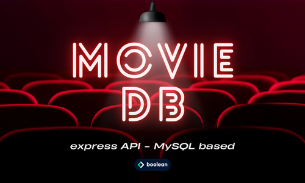

 
 

Esercizio #47 | Classe 137 | Boolean Academy

---

Studente: Fabio Ferrero

---
# English

## Target of the project:
We create a **new Express app**.
- **Let's connect the app to the db** and check that everything is working.
- We prepare **a route index** to get the list of movies
- We prepare **a show route** to get the details of an individual movie and its reviews
- Plug your APIs into controllers
- Insert your routes into a router
- Insert a middleware for non-existent routes
- Insert middleware for error handling
### Bonus
- Insert images into the express project and thus into the db
- Insert database connection data as environment variables
- Insert middleware for absolute path management of images

---
# Italiano

## Obiettivo del progetto:
 Creiamo una **nuova applicazione Express**
- **Colleghiamo l’app al db** e verifichiamo che tutto funzioni
- Prepariamo **una rotta index** per ottenere la lista dei film
- Prepariamo **una rotta show** per ottenere i dettagli di un singolo film e le sue recensioni
- Inserire le vostre API in controller
- Inserire le vostre rotte in un router
- Inserire un middleware per le rotte inesistenti
- Inserire un middleware per la gestione errori
### Bonus
- Inserire delle immagini nel progetto express e dunque nel db
- Inserire i dati di connessione al database come variabili d’ambiente
- Inserire un middleware per la gestione del percorso assoluto delle immagini

---

